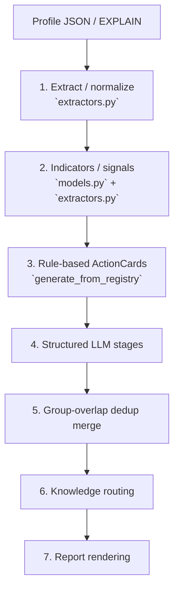
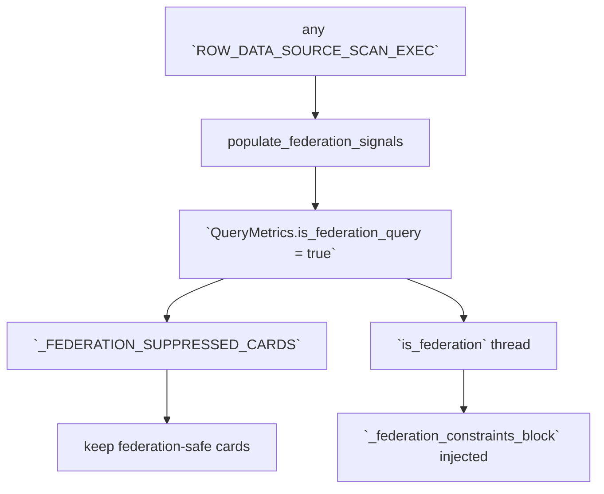

# 分析パイプライン

`docs/README.md:35` の版履歴を参照。本書は v5.19.0 のみを対象にする。

## 全体フロー

## ステージ一覧

| Step | 名称 | 主要関数 | 出力 |
|---|---|---|---|
| 1 | 抽出 | `dabs/app/core/extractors.py:409` | `QueryMetrics` / `NodeMetrics` / scan・shuffle・join 情報 |
| 2 | signal 生成 | `dabs/app/core/models.py:331` | `BottleneckIndicators` |
| 3 | rule-based emission | `dabs/app/core/analyzers/recommendations.py:24` | registry 22 cards |
| 4 | LLM stages | `dabs/app/core/usecases.py:188` | structured analysis / review / refine |
| 5 | LLM merge | `dabs/app/core/usecases.py:284` | group-overlap で dedup 済み `llm_action_cards` |
| 6 | knowledge routing | `dabs/app/core/knowledge_loader.py` | section_id 絞り込み |
| 7 | report rendering | `dabs/app/core/reporters/generator.py` | Markdown report |

## Rule-based ActionCards は registry 単独

v5.16.20 で Phase 3 legacy deletion が完了し、legacy `generate_action_cards` 内の巨大 if-block は削除された。現在は `generate_action_cards` が host として前処理・suppression・LC LLM 呼び出しを行い、実 emission 自体は `generate_from_registry` が担当する。`dabs/app/core/analyzers/recommendations.py:24`, `dabs/app/core/usecases.py:275`, `dabs/app/core/analyzers/recommendations_registry.py:13`

## 22 cards 一覧

| rank | card_id | 主な fire 条件 | root_cause_group |
|---:|---|---|---|
| 100 | `disk_spill` | spill / peak memory 圧迫 | `spill_memory_pressure` |
| 97 | `federation_query` | `query_metrics.is_federation_query` | `federation` |
| 95 | `shuffle_dominant` | shuffle write / memory inefficiency が支配的 | `shuffle_overhead` |
| 90 | `shuffle_lc` | notable shuffle key が LC 候補 | `shuffle_overhead` |
| 85 | `data_skew` | skew 指標 | `data_skew` |
| 80 | `low_file_pruning` | filter rate 低 + scan pruning 不足 | `scan_efficiency` |
| 75 | `low_cache` | cache hit 低 | `cache_utilization` |
| 72 | `compilation_overhead` | compile ratio 高 | `compilation_overhead` |
| 70 | `photon_blocker` | Photon blocker node 検出 | `photon_compatibility` |
| 68 | `photon_low` | Photon time 低 | `photon_compatibility` |
| 65 | `scan_hot` | hot scan operator | `scan_efficiency` |
| 60 | `non_photon_join` | non-Photon join / broadcast 改善余地 | `photon_compatibility` |
| 55 | `hier_clustering` | HC cardinality heuristic 該当 | `scan_efficiency` |
| 50 | `hash_resize` | hash resize / memory pressure | `spill_memory_pressure` |
| 45 | `aqe_absorbed` | AQE absorb 検出 | `shuffle_overhead` |
| 40 | `cte_multi_ref` | CTE multi-ref 検出 | `sql_pattern` |
| 38 | `investigate_dist` | 分布調査優先の advisory | `data_skew` |
| 35 | `stats_fresh` | stale / unknown stats | `statistics_freshness` |
| 32 | `driver_overhead` | queue / scheduling / compute-wait gap | `driver_overhead` |
| 30 | `rescheduled_scan` | rescheduled tasks | `scan_efficiency` |
| 28 | `cluster_underutilization` | effective parallelism 低 | `cluster_underutilization` |
| 25 | `compilation_absolute_heavy` | absolute compile 重いが ratio 小 | `compilation_absolute` |

カード順は `CARDS` tuple が canonical。`dabs/app/core/analyzers/recommendations_registry.py:872`, `dabs/app/core/action_classify.py:84`

## Federation suppression flow (v5.18.0)

- extractor は `ROW_DATA_SOURCE_SCAN_EXEC` tag を見て `NodeMetrics.is_federation_scan` を立てる。`dabs/app/core/extractors.py:579`
- `populate_federation_signals` が query-level の `is_federation_query`、`federation_tables`、`federation_source_type` を埋める。`dabs/app/core/extractors.py:504`
- recommendations host は `_FEDERATION_SUPPRESSED_CARDS` で 8 cards を suppress する。`dabs/app/core/analyzers/recommendations.py:42`
- LLM prompt には `is_federation` に応じて `_federation_constraints_block` を注入する。`dabs/app/core/llm_prompts/prompts.py:2231`

## Dedup は preservation marker ではなく group-overlap

v5.16.19 で preservation marker / hybrid dedup / Top-N selection は削除され、`root_cause_group` ベースの dedup に移行した。現在は rule-based cards を `analysis.action_cards` に残し、LLM 独自案だけを `analysis.llm_action_cards` に分離して保持する。`dabs/app/core/usecases.py:287`, `dabs/app/core/usecases.py:293`

- 同一 group は drop。`dabs/app/core/usecases.py:293`
- overlap group も drop。`dabs/app/core/usecases.py:307`, `dabs/app/core/action_classify.py:128`
- group が空なら fail-open で keep。`dabs/app/core/usecases.py:297`

## Join implicit CAST detector (v5.16.21)

JOIN key の暗黙 CAST は profile JSON だけでも検出できる。extractor が join ノードの LEFT_KEYS / RIGHT_KEYS を `NodeMetrics.join_keys_left` / `join_keys_right` に保持し、`analyzers/bottleneck.py::_collect_join_key_casts` が各 key 文字列に `CAST(...)` が含まれるかを検査、`_apply_join_key_cast_alert` が CRITICAL severity を付与する。EXPLAIN 側で既に `implicit_cast_on_join_key` フラグが立っていれば二重 fire を抑止する。`dabs/app/core/analyzers/bottleneck.py:83`, `dabs/app/core/analyzers/bottleneck.py:105`, `dabs/app/core/analyzers/explain_analysis.py:639`

## LC / HC 補助パス

- `shuffle_lc` は notable shuffle key を LC 候補へ昇格する。`create_clustering_prompt` は SQL body を渡さず、`candidate_columns_with_context` などの構造化 metadata だけを使う。`dabs/app/core/analyzers/recommendations.py:285`, `dabs/app/core/llm_prompts/prompts.py:2788`
- HC canonical SQL は `ALTER TABLE ... CLUSTER BY (...)`、`SET TBLPROPERTIES ('delta.liquid.hierarchicalClusteringColumns'=...)`、`OPTIMIZE FULL` に統一された。`dabs/app/core/llm_prompts/prompts.py:2994`
- cardinality 推定は name/type heuristic と `ColumnStat` を用いた composite 優先順位。`dabs/app/core/analyzers/recommendations.py:346`
