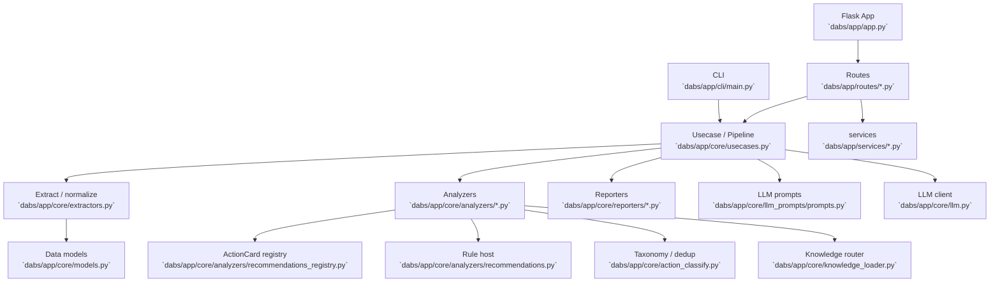

# アーキテクチャ概要

`docs/README.md:35` の版履歴を単一ソースとして参照し、本書では現行 v5.19.0 の構造だけを記述する。

## 全体アーキテクチャ図

## エントリポイント

| 層 | 主要エントリ | 説明 |
|---|---|---|
| CLI | `dabs/app/cli/main.py:190` | profile JSON / EXPLAIN を読み込み pipeline を起動 |
| Web | `dabs/app/routes/analyze.py` | Web UI から分析を起動 |
| Usecase | `dabs/app/core/usecases.py:118` | `run_analysis_pipeline` が抽出・分析・LLM・描画を統括 |
| Report | `dabs/app/core/reporters/generator.py` | Markdown レポート生成 |

## 主要モジュール

| モジュール | 役割 | 根拠 |
|---|---|---|
| `dabs/app/core/extractors.py` | profile JSON / EXPLAIN から `QueryMetrics`・`NodeMetrics`・signals を抽出 | `dabs/app/core/extractors.py:409`, `dabs/app/core/extractors.py:504` |
| `dabs/app/core/models.py` | `QueryMetrics` / `NodeMetrics` / `BottleneckIndicators` の現行定義 | `dabs/app/core/models.py:18`, `dabs/app/core/models.py:89`, `dabs/app/core/models.py:331` |
| `dabs/app/core/analyzers/recommendations_registry.py` | rule-based ActionCard 22 枚の唯一の registry source | `dabs/app/core/analyzers/recommendations_registry.py:1`, `dabs/app/core/analyzers/recommendations_registry.py:872` |
| `dabs/app/core/analyzers/recommendations.py` | registry host。serverless / federation suppression と LC LLM 呼び出しを担当 | `dabs/app/core/analyzers/recommendations.py:24`, `dabs/app/core/analyzers/recommendations.py:275` |
| `dabs/app/core/action_classify.py` | `root_cause_group` taxonomy、coverage category、group-overlap dedup | `dabs/app/core/action_classify.py:25`, `dabs/app/core/action_classify.py:128` |
| `dabs/app/core/llm_prompts/prompts.py` | Stage 1-3、rewrite、LC、federation 制約 block を生成 | `dabs/app/core/llm_prompts/prompts.py:2231`, `dabs/app/core/llm_prompts/prompts.py:2773` |

## ActionCard registry (v5.19.0)

`recommendations_registry.py` は Spark Perf-style の static-priority registry で、`CardDef` と `CARDS` tuple を使って rule-based ActionCard を priority 順に emit する。Phase 3 以降は legacy if-block は削除済みで、registry が唯一の rule-based source である。`dabs/app/core/analyzers/recommendations_registry.py:1`, `dabs/app/core/analyzers/recommendations.py:275`

| card_id | rank | 備考 |
|---|---:|---|
| `disk_spill` | 100 | spill 抑制 |
| `federation_query` | 97 | v5.18.0 追加 |
| `shuffle_dominant` | 95 | shuffle 主因 |
| `shuffle_lc` | 90 | v5.16.10 追加 |
| `data_skew` | 85 | skew |
| `low_file_pruning` | 80 | LC / pruning |
| `low_cache` | 75 | cache |
| `compilation_overhead` | 72 | v5.16.25 追加 |
| `photon_blocker` | 70 | Photon blocker |
| `photon_low` | 68 | Photon 利用率低 |
| `scan_hot` | 65 | scan hot spot |
| `non_photon_join` | 60 | non-Photon join |
| `hier_clustering` | 55 | canonical SQL は v5.16.18 で更新 |
| `hash_resize` | 50 | hash resize |
| `aqe_absorbed` | 45 | AQE absorbed |
| `cte_multi_ref` | 40 | CTE multi-ref |
| `investigate_dist` | 38 | distribution 調査 |
| `stats_fresh` | 35 | stats fresh |
| `driver_overhead` | 32 | v5.16.25 追加 |
| `rescheduled_scan` | 30 | rescheduled scan |
| `cluster_underutilization` | 28 | v5.19.0 追加 |
| `compilation_absolute_heavy` | 25 | v5.19.0 追加 |

根拠は registry の `CARDS` 定義。`dabs/app/core/analyzers/recommendations_registry.py:872`

## Federation 関連モジュール (v5.18.0)

| モジュール | 役割 | 根拠 |
|---|---|---|
| `dabs/app/core/models.py` | `NodeMetrics.is_federation_scan`、`QueryMetrics.is_federation_query` / `federation_tables` / `federation_source_type` を保持 | `dabs/app/core/models.py:73`, `dabs/app/core/models.py:121` |
| `dabs/app/core/extractors.py` | `ROW_DATA_SOURCE_SCAN_EXEC` から federation signals を集約 | `dabs/app/core/extractors.py:504`, `dabs/app/core/extractors.py:579` |
| `dabs/app/core/analyzers/recommendations.py` | `_FEDERATION_SUPPRESSED_CARDS` で 8 cards を suppress | `dabs/app/core/analyzers/recommendations.py:42` |
| `dabs/app/core/llm_prompts/prompts.py` | Stage 1/2 prompt に `_federation_constraints_block` を注入 | `dabs/app/core/llm_prompts/prompts.py:2231` |
| `dabs/app/core/knowledge/dbsql_tuning.md` | federation knowledge section | `dabs/app/core/knowledge/dbsql_tuning.md:1474` |

## データモデルの更新点

| 項目 | 内容 | 根拠 |
|---|---|---|
| `QueryMetrics` | queue timestamps 4、plan-structure 4、federation 3 fields を保持 | `dabs/app/core/models.py:49`, `dabs/app/core/models.py:63`, `dabs/app/core/models.py:73` |
| `BottleneckIndicators` | `effective_parallelism`、`cluster_underutilization_variant`、`cluster_underutilization_severity`、`compilation_absolute_heavy` を保持 | `dabs/app/core/models.py:453`, `dabs/app/core/models.py:462` |
| `NodeMetrics` | `join_keys_left` / `join_keys_right` と `is_federation_scan` を保持 | `dabs/app/core/models.py:121`, `dabs/app/core/models.py:125` |

## 関連ドキュメント

- pipeline 詳細: `docs/analysis-pipeline.md:1`
- ActionCard 詳細: `docs/action-plan-generation.md:1`
- knowledge 詳細: `docs/knowledge-injection.md:1`
