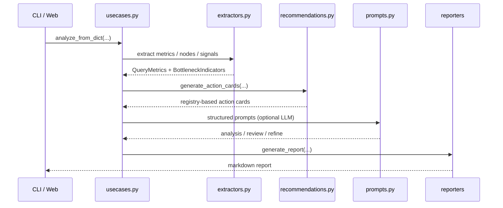

# データフロー

大きなフロー変更はない。現行 docs セットは v5.19.0 を対象とし、版履歴の詳細は `docs/README.md:35` を参照する。

## 分析フロー

## 現行の注記

- v5.18.0 で federation 検出が `analyze_from_dict` 経路に入った。`run_analysis_pipeline` は `is_federation_query` を見て LLM thread に `is_federation` を渡す。`dabs/app/core/usecases.py:188`, `dabs/app/core/extractors.py:504`
- federation detection の元は `ROW_DATA_SOURCE_SCAN_EXEC` → `NodeMetrics.is_federation_scan`。`dabs/app/core/extractors.py:579`
- v5.19.0 で `QueryMetrics` / `BottleneckIndicators` のフィールドは増えたが、上位の sequence は不変。`dabs/app/core/models.py:63`, `dabs/app/core/models.py:453`
