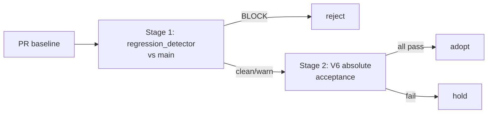
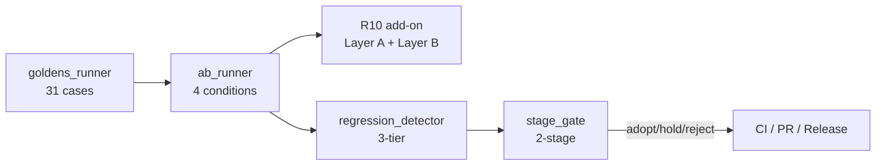

# v5 vs V6 比較ドキュメント

V5.19 と V6.0 の差分を 1 ページで把握できるようにまとめる。
詳細は `v6-spec.md` (V6 仕様総論) と `v6/README.md` (個別索引) を参照。

## 0. 一行要約

V5.19 は「**LLM が良い答えを出すパイプライン**」、
V6.0 は「**LLM の答えの質を測定 → 検知 → ゲートする品質基盤**」
を完成させたリリース。

---

## 1. ヘッドライン差分

| 観点 | V5.19 | V6.0 |
|------|-------|------|
| **目的** | レポート品質の改善 (LLM 提案の精度) | 品質を **測る・決める・直接上げる** 基盤の整備 |
| **アウトプット** | Markdown report + ActionCard list | 上記 + **canonical Report JSON (v6.0 schema)** |
| **品質指標** | (内部、定量化なし) | **5 指標 + L1-L4 採点基準** (`docs/eval/report_quality_rubric.md`) |
| **評価フロー** | eval/ で個別実走 | **goldens 31 cases + A/B 4 conditions + R10 add-on + Stage Gate** |
| **CI ゲート** | スモークテスト (API/UI) | スモーク + **複合 quality gate** (Q3/Q4/Q5/recall/halluc/schema/regression) |
| **採用判定** | 手動 | **2-stage gate** (regression × absolute → adopt/hold/reject) |
| **LLM パイプライン** | 3-stage (analyze + review + refine) 全部に knowledge 注入 | 同上 + **6 V6 flags** で knowledge 注入を段階的に削減可能 |
| **後方互換** | (該当なし) | **default off で v5.19 同等動作**、flag on で V6 機能を段階有効化 |
| **互換破壊** | — | `generate_report_legacy` 削除 |

---

## 2. 新機能 (V6 で追加された 6 つのコア機能)

各機能は **「なぜ必要か」「どう使うか」「コード参照」** をセットで記載。
詳細仕様は各 doc を辿る。

### 2.1 canonical Report JSON Schema v6.0 (W2 で導入)

**何が変わったか:**
LLM 出力 / レポートデータが **schema validated な dict** になった。V5 では
ActionCard.evidence が `list[str]` (自然言語) で「12 GB のスピル」のような
記述が許されていたが、V6 では `Evidence.metric / value_raw / source /
grounded` が必須となり、profile に存在しない数値は機械的に検出可能に。

**なぜ必要か:**
- V5 レポートの hallucination は「半端な構造」が温床だった。例: `evidence:
  ["spill_bytes=8GB"]` という文字列だけでは、`8GB` が profile から来た
  ものか LLM の捏造か判別不能
- canonical schema で `Evidence.grounded=true` は「profile に存在する
  metric のみ」と契約化 → 検証可能

**主要 Entity:**

| entity | 必須フィールド | 由来 |
|--------|---------------|------|
| `Report` | `schema_version="v6.0"`, `report_id`, `query_id`, `context`, `summary`, `findings` | W2 Day 2 |
| `Finding` | `issue_id` (snake_case), `category` (18 enum), `severity`, `title`, `evidence` (≥1), `actions` | 同 |
| `Evidence` | `metric`, `value_display`, `source` (taxonomy), `grounded` | 同 |
| `Action` | `action_id`, `target`, `fix_type` (8 enum), `what` | W2 Day 4 + W2.5 |

**追加された Action フィールド (W2.5 / V6.1):**
- `preconditions`: 適用前提 (例: "OPTIMIZE 実行可能なクラスタ容量")
- `rollback`: 元に戻す手段 (`config / sql / manual / irreversible / auto`)
- `impact_confidence`: 効果の確度 (`high / medium / low / needs_verification`)
- `fix_sql_skeleton` / `fix_sql_skeleton_method` / `fix_sql_chars_*` (V6.1)

**使い方:**
```python
from core.v6_schema import build_canonical_report
from eval.scorers.r4_schema import score_schema

# ActionCard → canonical (legacy adapter)
report = build_canonical_report(profile_analysis)
schema_score = score_schema(report)  # → SchemaScore(valid=True/False)
```

**詳細:** [`docs/v6/output_contract.md`](v6/output_contract.md)

---

### 2.2 8 V6 feature flags

**何が変わったか:**
V5 の挙動を一切変えずに V6 機能を **段階的に有効化** できるよう、8 個の
独立した env var フラグを導入。

**フラグ一覧:**

| Flag | default | 機能 | 由来 |
|------|---------|------|------|
| `V6_CANONICAL_SCHEMA` | off | LLM が canonical JSON block を直接 emit | W3.5 |
| `V6_REVIEW_NO_KNOWLEDGE` | off | Stage 2 review で knowledge 注入 skip | W3 |
| `V6_REFINE_MICRO_KNOWLEDGE` | off | Stage 3 refine knowledge を 4KB cap | W3 |
| `V6_ALWAYS_INCLUDE_MINIMUM` | off | ALWAYS_INCLUDE を `bottleneck_summary` のみに縮小 | W3 |
| `V6_SKIP_CONDENSED_KNOWLEDGE` | off | 二次要約呼び出しを skip | W3 |
| `V6_RECOMMENDATION_NO_FORCE_FILL` | off | "根拠不足は省略" directive を prompt 末尾に追加 | W3.5 |
| `V6_SQL_SKELETON_EXTENDED` | off | MERGE/VIEW/INSERT を構造抽出 | V6.1 |
| `V6_COMPACT_TOP_ALERTS` | off | `## 2. Top Alerts` 廃止、Section 1 末尾の `### Key Alerts` に統合 + issue-tag 参照 | v6.6.0 |

**優先順位:** env var > `runtime-config.json` (lowercase key) > default

**なぜ必要か:**
V5 → V6 の互換破壊を最小限にし、A/B 評価で「どのフラグが品質を上げるか」
を独立検証可能にするため。Codex W2.5 の指摘 #1-#4 を実装するための
foundation。

**使い方:**
```bash
# Step 1: 全 off で v5 同等
./scripts/deploy.sh dev

# Step 2: 1 つずつ有効化して A/B
V6_ALWAYS_INCLUDE_MINIMUM=1 ./scripts/deploy.sh dev

# Step 3: 全 on で V6 最終形
V6_CANONICAL_SCHEMA=1 V6_REVIEW_NO_KNOWLEDGE=1 ... ./scripts/deploy.sh dev
```

**コード:**
```python
from core import feature_flags
if feature_flags.canonical_schema():
    # LLM 出力に canonical JSON directive を追加
```

**詳細:** [`docs/knowledge/v6_knowledge_policy.md`](knowledge/v6_knowledge_policy.md)

---

### 2.3 Q3 Evidence Grounding scorer (W3 + W3.5 で完成)

**何が変わったか:**
レポート内の数値や引用が profile evidence に anchor されているかを
**5 シグナルで定量化** する scorer を追加。Codex W3 review で楽観的だった
等重み平均を **加重 composite** に変更。

**5 シグナル:**

| # | シグナル | 内容 | 重み |
|---|---------|------|------|
| 1 | `metric_grounding_ratio` | `Evidence.grounded=true` の比率 | 0.30 |
| 2 | `ungrounded_numeric_ratio` | text 中の数値が profile/grounded に anchor あるか | 0.20 (反転) |
| 3 | `valid_source_ratio` | `Evidence.source` が許可 taxonomy 内か | 0.075 |
| 4 | `valid_knowledge_section_ratio` | `knowledge:<sid>` が実在する section_id か | 0.075 |
| 5 | `finding_support_ratio` | 各 Finding が ≥1 件の grounded=true & non-synthetic evidence を持つか | 0.35 |

`composite_score = Σ (signal × weight)` で 0-1 の単一値。

**Source taxonomy (V6 で固定):**
- `profile.<path>` 例: `profile.queryMetrics.spill_to_disk_bytes`
- `node[<id>].<path>` 例: `node[12].operator_stats.peak_memory`
- `alert:<category>` 例: `alert:memory`
- `knowledge:<section_id>` 例: `knowledge:spill`
- `synthetic` (合成、Q3 で grounded=false 強制)

**Codex W3.5 #2 修正前後:**
```
W3 (等重み):    composite = 5 sub の単純平均  → 76.76% (楽観的)
W3.5 (加重):    composite = 加重平均           → 64.99% (現実値、taxonomy/id 100% が押し上げない)
```

**使い方:**
```python
from eval.scorers.evidence_grounding import score_evidence_grounding

score = score_evidence_grounding(canonical_report, profile_known_metrics={...})
# score.composite_score: 0..1
# score.metric_grounding_ratio: 0..1
# score.finding_support_ratio: 0..1
```

**詳細:** [`docs/eval/scorer_mapping.md`](eval/scorer_mapping.md), `eval/scorers/evidence_grounding.py`

---

### 2.4 Q4 Actionability scorer (W1 + W5 + W6 で完成)

**何が変わったか:**
レポート内の Action が「実行可能か」を **7 dimension** で採点する scorer。
W5 で `citation` (skeleton が profile identifier 引用) を 7 個目の dim に
追加し、6/7 で specific と判定するよう threshold 厳格化。

**7 dimension:**

| dim | 説明 | チェック方法 |
|-----|------|------------|
| `target` | 何を変えるか | column / table / config key |
| `what` | 何をするか | action verb / fix_type |
| `why` | なぜ必要か | rationale フィールド |
| `how` | どう変えるか | fix_sql / fix_type で具体化 |
| `expected_effect` | 期待効果 | quantitative or directional |
| `verification` | 検証方法 | metric / sql / explain pattern |
| `citation` (W5) | profile 引用根拠 | fix_sql_skeleton が profile に存在する table/column を含む |

**lenient / strict 二系統 (W6 Codex W5 #3 反映):**
- `lenient`: `profile_known_identifiers` なし → skeleton 非空で citation pass
- `strict`: `profile_known_identifiers` 必須 → skeleton 内に既知識別子があるときのみ pass

**使い方:**
```python
from eval.scorers.actionability import score_canonical_report_actions_dual

dual = score_canonical_report_actions_dual(
    report,
    profile_known_identifiers={"fact_orders", "customer_id", ...},
)
# dual["lenient"]: list[ActionabilityScore]
# dual["strict"]:  list[ActionabilityScore]
```

**例:**
```python
# Action 1: 6/7 dim 揃い is_specific=True
# Action 2: target/what/fix_sql のみ → 3/7 → False
# aggregate_actionability(scores) → 0.5 (1/2 specific)
```

**詳細:** `eval/scorers/actionability.py`

---

### 2.5 Q5 Failure Taxonomy scorer (W5 で導入)

**何が変わったか:**
レポートの **失敗パターンを 5 categories で分類**。これまでは「品質低い」
としか言えなかったのが、Week 6 R9 regression detector で「どの category
が悪化したか」を case 単位で追えるようになった。

**5 category + penalty:**

| category | 内容 | penalty (per incident) |
|----------|------|----------------------|
| `parse_failure` | SQL skeleton method ∈ {head_tail, truncate} | 0.15 (W6 で 0.10→0.15) |
| `evidence_unsupported` | Finding に grounded=true な evidence ゼロ | 0.20 |
| `false_positive` | suppression 対象なのに finding 出した | 0.15 |
| `over_recommendation` | 1 finding に actions > 3 | 0.05 |
| `missing_critical` | golden の must_cover_issues (critical/high) 見逃し | 0.30 |

`score = max(0, 1.0 - Σ penalty × incident_count)`

**使い方:**
```python
from eval.scorers.failure_taxonomy import score_failure_taxonomy

ft = score_failure_taxonomy(
    canonical_report,
    must_cover_issues=golden_case["must_cover_issues"],
    suppression_expected=[claim["id"] for claim in golden_case["forbidden_claims"]],
)
# ft.score: 0..1
# ft.counts: {"parse_failure": 0, "missing_critical": 1, ...}
# ft.incidents: [{"category": ..., "issue_id": ...}]
```

**rule-based baseline 例:**
```
Q5 failure taxonomy: 17.58% (rule-based では多くの failure が露出)
↓ LLM 込み V6 flags on で 70%+ を狙う
```

**詳細:** `eval/scorers/failure_taxonomy.py`

---

### 2.6 R9 Regression detector + R5 2-stage gate (W6 で導入)

**何が変わったか:**
PR / リリース時に「品質劣化があるか」を **3-tier で機械判定** + V6 採用
判定の **2-stage gate** を追加。Codex W3.5 で指摘された "case 別 regression
0-1 件以内" 等の合格基準を CI で自動化。

**R9 Regression Detector — 3 tier:**

| Tier | 動作 | 何を見るか |
|------|------|----------|
| **1 BLOCK** | exit 1 / `reject` | Q3/Q4/Q5/recall_strict/hallucination -3pt 超 / schema -1% 超 |
| **2 WARN** | log + exit 0 | parse_success_rate -5pt / ungrounded_numeric +5pt / canonical_parse_failure +5pt / over_recommendation +1 |
| **3 INFO** | 記録のみ | skeleton method 分布シフト >10pt |

**R5 2-stage gate:**



**Stage 2 absolute thresholds (V6 acceptance):**
- schema_pass = 100%
- q3_composite ≥ 80%
- actionability_specific ≥ 80%
- failure_taxonomy ≥ 70%
- recall_strict ≥ 50%
- hallucination_clean ≥ 0.85
- ungrounded_numeric ≤ 15%
- parse_success_rate ≥ 90%
- canonical_parse_failure ≤ 5%
- case_regressions ≤ 1

**使い方 (CI):**
```bash
# Stage 1 単独 (regression のみ)
python -m eval.regression_detector \
  --current eval/baselines/pr.json \
  --baseline eval/baselines/main.json

# 2-stage まとめて (R5 採否)
python -m eval.stage_gate_runner \
  --current eval/baselines/pr.json \
  --baseline eval/baselines/main.json \
  --on-reject-exit 1
# adopt → exit 0
# hold → exit 0 (PR コメント)
# reject → exit 1 (PR ブロック)
```

**詳細:** [`docs/eval/regression_detector_design.md`](eval/regression_detector_design.md), [`docs/eval/v6_acceptance_policy.md`](eval/v6_acceptance_policy.md)

---

### 2.7 MERGE / CREATE VIEW / INSERT skeleton 構造抽出 (V6.1)

**何が変わったか:**
V5 では SQL を **3000 chars で盲目的 truncate** していたため、長い CTE や
最終 SELECT が LLM に見えなかった。V6.1 で sqlglot ベースの構造抽出を
追加。8 method (`fullsql / sqlglot / merge / view / insert / bypass /
head_tail / truncate`) で適切な経路にディスパッチ。

**保持する構造:**
- `WITH/CTE 名` + 参照関係
- `FROM/JOIN 種別 / 相手 table`
- `WHERE / ON predicate shape` (eq/range/like/in/exists/or_heavy)
- `GROUP BY / ORDER BY / HAVING` 列名
- `MERGE` の `WHEN MATCHED/NOT MATCHED + UPDATE/INSERT/DELETE`
- `CREATE VIEW AS SELECT` の inner SELECT
- `INSERT INTO SELECT` の inner SELECT

**落とす:**
- 値リテラル / 列リスト詳細 / 関数本体

**例 (元 SQL → skeleton):**
```sql
-- V5: 3000 chars truncate (CTE が見えない)
WITH ranked AS (
  SELECT ... FROM fact_orders WHERE order_ts >= '2025-01-01'
), top AS (...)
SELECT region, AVG(n) FROM enriched
WHERE region IS NOT NULL AND n BETWEEN 5 AND 1000
ORDER BY avg_n DESC LIMIT 100
```

```
-- V6.1 sqlglot skeleton (literal なし、構造のみ)
WITH ranked, top, enriched
  ranked: from=fact_orders
  top: from=ranked
  enriched: from=top, joins=[INNER, LEFT]
SELECT <3 cols>
FROM enriched
INNER JOIN dim_customer ON [eq]
WHERE [range]
GROUP BY region
ORDER BY avg_n
LIMIT *
```

**MERGE 抽出例 (V6.1 で初めて構造化):**
```
MERGE INTO catalog.schema.target
USING (SELECT FROM stage_table)
ON [eq]
WHEN MATCHED [eq] THEN UPDATE
WHEN NOT MATCHED [always] THEN INSERT
```

**使い方:**
```python
from core.sql_skeleton import build_sql_skeleton

# V6_SQL_SKELETON_EXTENDED=1 で MERGE/VIEW/INSERT 構造抽出有効
result = build_sql_skeleton(sql, char_budget=2500)
# result.method: "sqlglot" / "merge" / "view" / "insert" / ...
# result.skeleton: 圧縮された構造テキスト
# result.compression_ratio: skeleton_chars / original_chars
```

**詳細:** [`docs/v6/sql_skeleton_design.md`](v6/sql_skeleton_design.md)

---

### 2.8 R10 Layer B LLM judge wrapper (V6.1)

**何が変わったか:**
W4 で deterministic な R10 Layer A (R4/Q3/Q4/Q5/recall/hallucination の
重み付き集約) を入れた。V6.1 で **LLM judge ベースの Layer B** を追加し、
deterministic では判定できない nuance (診断妥当性 / 推奨の意義) を補完。

**設計原則 (Codex W4 review §3-4):**
- Layer A (deterministic) と Layer B (LLM judge) は **混ぜない**
- 各 reasons[] で「どの sub-score が落としたか」を明示
- LLM 利用は cost 制御のため top-N action のみ (default 5)

**Layer B の集約:**
```
layer_b = (L3_diagnosis × 0.5 + L4_fix_relevance × 0.25 + L4_fix_feasibility × 0.25) / 5
final = (layer_a + layer_b) / 2  (Layer B が None なら layer_a のみ)
```

**ab_runner 統合:**
```bash
# LLM judge 込み
python -m eval.ab_runner \
  --run-name v6_acceptance \
  --with-llm-judge \
  --judge-top-n 5 \
  --judge-model databricks-claude-sonnet-4
```

**現状の制約 (Codex V6.1 review):**
canonical Report が baseline JSON に persist されていないため、ab_runner
での Layer B 入力は placeholder。完全統合は **V6.2 tier 1** backlog。

**詳細:** [`docs/eval/r10_quality_addon_design.md`](eval/r10_quality_addon_design.md), `eval/scorers/r10_quality_judge.py`

---

### 2.9 LLM acceptance runbook (V6.1)

**何が変わったか:**
V6 を **本番採用判定** するための実走手順を文書化。Codex V6 final review
で「本番採用前の必須」とされた 3 項目 (LLM 込み Stage 2 / per-signal
gate / Failure taxonomy 実測) をすべてカバー。

**1 コマンド実行例:**
```bash
export DATABRICKS_HOST=...
export DATABRICKS_TOKEN=...

PYTHONPATH=dabs/app:. uv run python -m eval.ab_runner \
  --run-name v6_acceptance_$(date +%Y%m%d) \
  --with-llm-judge \
  --gate-w4-infra \
  --gate-llm-quality \
  --gate-condition both \
  --gate-r10-verdict pass
```

**ステージ別実行 (デバッグ用):**
- Step 1: baseline 取得 (LLM 込み) — `goldens_runner` を 31 cases で実走
- Step 2: A/B 比較 (4 conditions: baseline/canonical-direct/no-force-fill/both)
- Step 3: stage gate (v5.19 ベースラインと比較、verdict 判定)

**コスト目安:**
- `--judge-top-n 5` で 4 conditions = 20 LLM calls / run
- Sonnet 4.6 で 1 run あたり数 USD 程度

**PR / Nightly / Release 工程:**

| 段階 | 期待 verdict | 動作 |
|------|-------------|------|
| 開発者 PR | hold 許容 | コメントで品質レポート、merge は人間判断 |
| Nightly main | adopt 推奨 | 失敗時 Slack 通知 |
| Release tag | adopt 必須 | reject/hold で release 中止 |

**canonical_parse_failure が高い時のトラブルシューティング:**
1. `canonical_source_breakdown` を確認 (`normalizer_fallback` か `missing` か)
2. `normalizer_fallback` ばかり = LLM が `json:canonical_v6` block を出していない → directive 確認
3. `missing` = LLM 起動自体が失敗 → API 設定確認

**詳細:** [`docs/eval/llm_acceptance_runbook.md`](eval/llm_acceptance_runbook.md)

---

### サマリー: V5 → V6 で「何が新しいか」

| 視点 | V5.19 | V6.0 / V6.1 |
|------|-------|------------|
| **データ** | ActionCard (半構造化) | canonical Report (JSON Schema validated) |
| **品質可視化** | 内部のみ | Q3/Q4/Q5/R10 で定量化 |
| **CI gate** | smoke のみ | + Stage 1 regression + Stage 2 absolute |
| **LLM 制御** | 一律注入 | 8 flags で段階制御 |
| **SQL 入力** | 3000 chars truncate | 8 method skeleton (MERGE/VIEW/INSERT 含む) |
| **採用判定** | 手動 | adopt/hold/reject 自動 |
| **運用** | 経験則 | runbook + 31 goldens で再現可能 |

---

## 3. データモデルの変化

### V5.19: ActionCard ベース

```
ProfileAnalysis
├── action_cards: list[ActionCard]
│   ├── problem (str)
│   ├── evidence (list[str])  # 自然言語
│   ├── fix (str)
│   ├── fix_sql (str)
│   ├── expected_impact (str)
│   ├── verification_steps (list[dict | str])  # 半構造化
│   └── ...
└── bottleneck_indicators
    └── alerts: list[Alert]  # category, severity, current_value (str), ...
```

問題: evidence / verification が **半構造化**。LLM が "それっぽい" 数値を
自然言語で吐けてしまい、検証が困難。

### V6.0: canonical Report

```
Report (schema_version=v6.0)
├── context (is_serverless, is_streaming, is_federation, ...)
├── summary (headline, verdict, key_metrics)
├── findings: list[Finding]
│   ├── issue_id (snake_case, 30件レジストリ)
│   ├── category (18 enum)
│   ├── severity / confidence
│   ├── evidence: list[Evidence]
│   │   ├── metric (canonical name)
│   │   ├── value_raw / value_display
│   │   ├── source (taxonomy: profile.* / node[i].* / alert:* / knowledge:* / synthetic)
│   │   └── grounded (bool, 機械検証)
│   └── actions: list[Action]
│       ├── action_id, target, fix_type
│       ├── what / why / fix_sql
│       ├── fix_sql_skeleton (V6.1, sqlglot 由来)
│       ├── expected_effect / expected_effect_quantitative
│       ├── preconditions / rollback / impact_confidence (W2.5)
│       └── verification (oneOf metric / sql / explain)
└── appendix_excluded_findings (suppression rule で抑制された finding)
```

利点:
- **schema レベルで構造を強制** → 半端な finding は弾ける
- **evidence.grounded** で hallucination 検出が機械的に可能
- **Action の 7 dim** (target/what/why/how/expected_effect/verification/citation) で actionability を定量化

### Adapter

V5.19 の `ActionCard` 出力は `core/v6_schema/normalizer.py` で
canonical Report に変換可能 (legacy adapter)。LLM canonical-direct 出力
は `V6_CANONICAL_SCHEMA=on` で有効化。

---

## 4. LLM パイプライン変化

### V5.19

```
analyze (knowledge 30KB)
  → review (knowledge 30KB 再注入)
    → refine (knowledge 30KB 再注入)
```

### V6.0 (V6 flags すべて on)

```
V6_ALWAYS_INCLUDE_MINIMUM=1 → ALWAYS_INCLUDE = [bottleneck_summary] のみ
V6_REVIEW_NO_KNOWLEDGE=1 → review knowledge 0KB
V6_REFINE_MICRO_KNOWLEDGE=1 → refine knowledge ≤ 4KB (review 指定 section のみ)
V6_SKIP_CONDENSED_KNOWLEDGE=1 → 二次要約 skip
V6_RECOMMENDATION_NO_FORCE_FILL=1 → "根拠不足は省略" を prompt に
V6_CANONICAL_SCHEMA=1 → canonical JSON block を直接 emit
```

Codex 推奨 budget:
- analysis: 8-15 KB (V5 30KB から大幅削減)
- review: 0 KB (理想) / 最大 2 KB
- refine: 0-4 KB (issue 解決に必要な断片のみ)

---

## 5. 評価基盤の変化

### V5.19

`eval/` ディレクトリで個別実走、結果は手動レビュー。

### V6.0



CI ゲート例:
```bash
python -m eval.ab_runner \
  --gate-w4-infra \                      # rule-based でも pass
  --gate-llm-quality \                   # LLM 込み実走時のみ pass 可
  --gate-finding-support 0.55 \          # per-signal
  --gate-metric-grounded 0.40 \
  --gate-evidence-grounding 0.65 \
  --gate-r10-verdict pass
```

---

## 6. 削除・破壊的変更

### 削除された項目 (V6 PR で破壊的)

| 削除対象 | 場所 | 代替 |
|---------|------|------|
| `generate_report_legacy()` | `dabs/app/core/reporters/__init__.py` | `generate_report()` (新形式) |
| 同 import / __all__ 4 ファイル分 | `profiler_analyzer.py`, `core/__init__.py`, `reporters/__init__.py` | 上記 |

### 削除されない (歴史コメントのみ)

| 残るもの | 理由 |
|---------|------|
| `sections.py:614` "legacy 4-column table" | `explain_analysis=None` 時の **fallback 動作中** |
| `sections.py:688` "legacy report template" | コメントのみ、動作影響なし |
| `tmp/app/app/` 重複ディレクトリ | V6 スコープ外、別 PR で対応 |

---

## 7. ロードマップ進捗

V6 リファクタは W1-W6 + V6.1 で初期スコープを完了し、その後の v6.0-v6.6
で運用反映と品質安定化を継続している。詳細: [`v6/README.md`](v6/README.md)。

### W1-W6 + V6.1 (基盤)

| Week | 焦点 | 状態 |
|------|------|------|
| W1 | 品質定義 (rubric / 18 goldens / 3 scorer) | ✅ |
| W2 | canonical schema (R4 + normalizer) | ✅ |
| W2.5 | Codex 指摘 10 件対応 | ✅ |
| W3 | knowledge 整理 + Q3 evidence grounding | ✅ |
| W3.5 | Codex 指摘 5 件対応 (canonical-direct LLM 等) | ✅ |
| W4 | A/B runner + R10 add-on | ✅ |
| W5 | SQL skeleton + Q4 + Q5 | ✅ |
| W6 | R9 regression + R5 stage gate + V6 acceptance | ✅ |
| V6.1 | MERGE 抽出 + Layer B + LLM runbook | ✅ |

### v6.0-v6.6 (運用反映)

| 版 | 主な追加 | 状態 |
|---|---------|------|
| v6.0.0 | dev deploy + 全 7 flag ON でベンチ (8 flag 目 V6_COMPACT_TOP_ALERTS は v6.6.0 追加) | ✅ |
| v6.1.0 | rule-based `decimal_heavy_aggregate` ActionCard + Q23 退行修正 | ✅ |
| v6.2.0 | **L1 (rule_echo) + L2 (invariants)** + L5 feedback box | ✅ |
| v6.3.0 | per-action 改善要望 UI (各 ActionCard 横の💡 + dropdown) | ✅ |
| v6.4.0 | **L5 Phase 1**: per-analysis ZIP export + signed token + redaction | ✅ |
| v6.5.0 | **L5 Phase 1.5**: bulk ZIP (`/feedback/export`、admin gate、orphan_reason) | ✅ |
| v6.5.x | i18n 整理 (67 JA-msgid → EN msgid + ja.po 訳) + 文言調整 | ✅ |
| v6.6.0 | **Top Alerts compact** (Section 1 統合 + issue-tag 参照) | ✅ |

### Backlog

| 項目 | 状態 | 参照 |
|------|------|------|
| L5 Phase 2: 中央 ingest pipeline (vendor_account_id + 3 schema 昇格) | TODO | TODO.md `## L5 Phase 2` |
| strict mode redaction (table/column 名も hash) | TODO | Codex Phase 2 推奨 |
| canonical Report Delta persist (Layer B 完全化) | TODO | V6.2 |
| UPDATE/DELETE SQL skeleton | TODO | V6.2 |
| PR コメント自動化 (regression alert) | TODO | V6.2 |

---

## 8. 数値: V5.19 ベース vs V6 (rule-based 31 cases)

| 指標 | V5.19 想定 | V6.0 baseline (rule-based) |
|------|----------|---------------------------|
| Schema pass | (該当なし) | **100%** |
| Q3 composite (重み付き) | (該当なし) | **64.22%** |
| Q4 actionability | (該当なし) | **94.52%** lenient / 94.52% strict |
| Q5 failure taxonomy | (該当なし) | **17.58%** (rule-based 床、LLM で改善期待) |
| R10 layer_a | (該当なし) | **62.34%** (borderline) |
| Stage gate | (該当なし) | **hold** (Stage 1 pass / Stage 2 fail) |
| Regression vs W6 | (該当なし) | **clean** |

LLM 込み実走 (`docs/eval/llm_acceptance_runbook.md`) で **adopt 判定**
を出して初めて本番採用基準達成。

---

## 9. 移行ガイド (v5 → v6)

### Step 1: deploy / V6 flags すべて off (v5 同等動作)

```bash
./scripts/deploy.sh dev   # V6 コード、flags off
```

→ 既存 V5 と同じ挙動、回帰なし。

### Step 2: 段階的に flag を on

```bash
# (ローカル / dev で評価)
V6_ALWAYS_INCLUDE_MINIMUM=1 ./scripts/deploy.sh dev
# ↑ knowledge 注入を縮小、結果を A/B runner で比較

V6_RECOMMENDATION_NO_FORCE_FILL=1 V6_ALWAYS_INCLUDE_MINIMUM=1 ./scripts/deploy.sh dev
# ↑ さらに format 圧力緩和

V6_CANONICAL_SCHEMA=1 ... ./scripts/deploy.sh dev
# ↑ canonical-direct 出力モード
```

各段階で `eval/ab_runner.py` を回し、Stage Gate verdict が `adopt` を
保てるかを確認。

### Step 3: V6 acceptance

LLM 込み実走で `--gate-llm-quality --gate-r10-verdict pass` が exit 0
で抜ければ V6 本番採用可。

詳細手順: `docs/eval/llm_acceptance_runbook.md`

---

## 10. 既知の制約

| 制約 | 影響 | 緩和 |
|------|------|------|
| canonical Report が baseline JSON に persist されてない | Layer B LLM judge が実 Report を見れない | V6.2 で対応 |
| MERGE 構造抽出は V6.1 で実装、UPDATE/DELETE は bypass | UPDATE/DELETE クエリで skeleton 化されない | V6.2 で対応 |
| LLM 込み実走の baseline 未取得 | 本番採用判定がまだできていない | `docs/eval/llm_acceptance_runbook.md` で実走 |
| `tmp/app/app/` 重複 | V6 ブランチでは触らず | 別 PR |

---

## 11. 互換マトリクス

| 動作 | V5.19 | V6 (flags off) | V6 (flags on) |
|------|-------|----------------|---------------|
| Markdown report 出力 | ○ | ○ | ○ |
| ActionCard JSON | ○ | ○ | ○ |
| canonical Report JSON | ✗ | ○ (normalizer adapter) | ○ (LLM 直接出力) |
| Q3/Q4/Q5/R10 評価 | ✗ | ✗ (scorer はあるが知識・goldens なし) | ✗ (LLM 込み実走で結果出る) |
| Stage Gate | ✗ | ○ (rule-based 完結) | ○ (実品質を含む) |
| `generate_report_legacy` | ○ | **✗ 削除** | **✗ 削除** |

---

## 12. 参照

- [`v6-spec.md`](v6-spec.md) — V6 仕様総論
- [`v6/README.md`](v6/README.md) — V6 ドキュメント索引
- [`eval/v6_acceptance_policy.md`](eval/v6_acceptance_policy.md) — 採用判定の正本
- [`eval/llm_acceptance_runbook.md`](eval/llm_acceptance_runbook.md) — LLM 込み実走手順
- [`eval/report_quality_rubric.md`](eval/report_quality_rubric.md) — 5 品質指標
- TODO.md `### v6.0 — レポート品質向上リファクタリング` — 進捗ログ

---

## 13. 履歴

| 日付 | 内容 |
|------|------|
| 2026-04-25 | V6 6 週間 (W1-W6) + W2.5 + W3.5 + V6.1 完了 |
| 2026-04-25 | dev に V6.0 デプロイ確認 |
| 2026-04-25 | 本ドキュメント作成 (V6.1 直後) |
