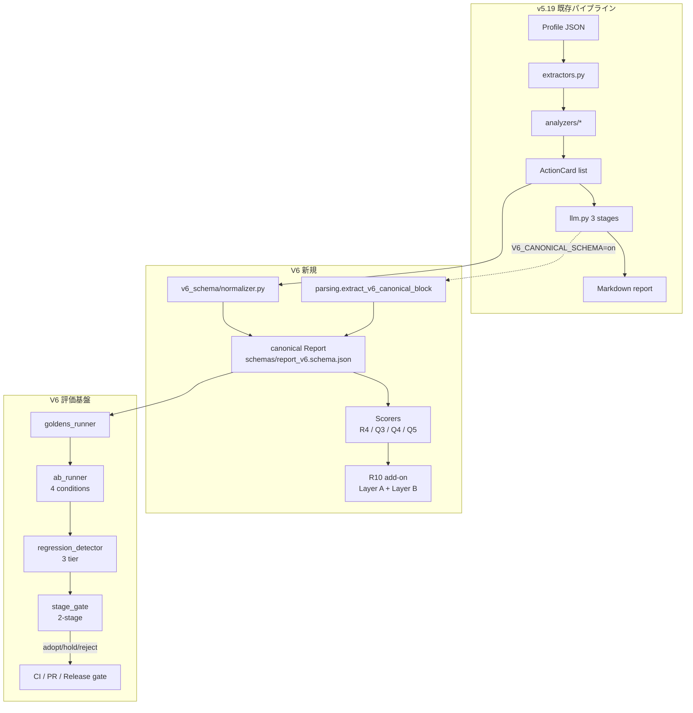
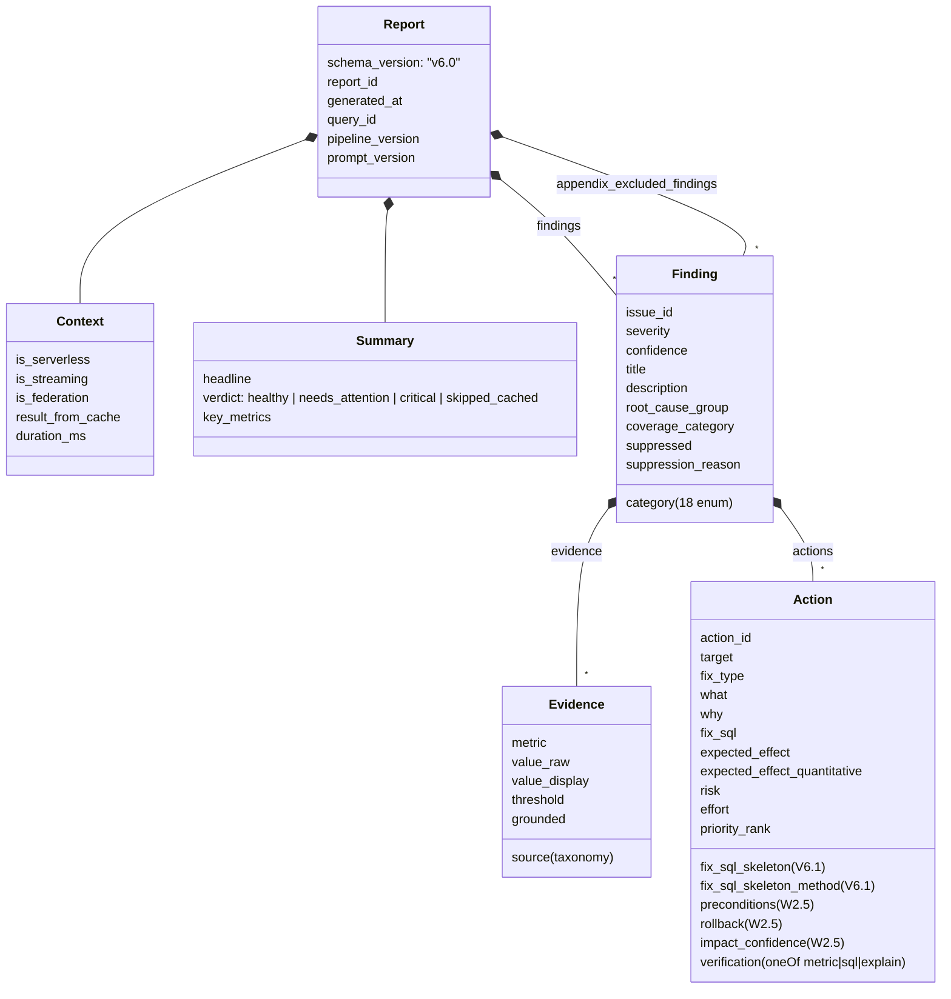
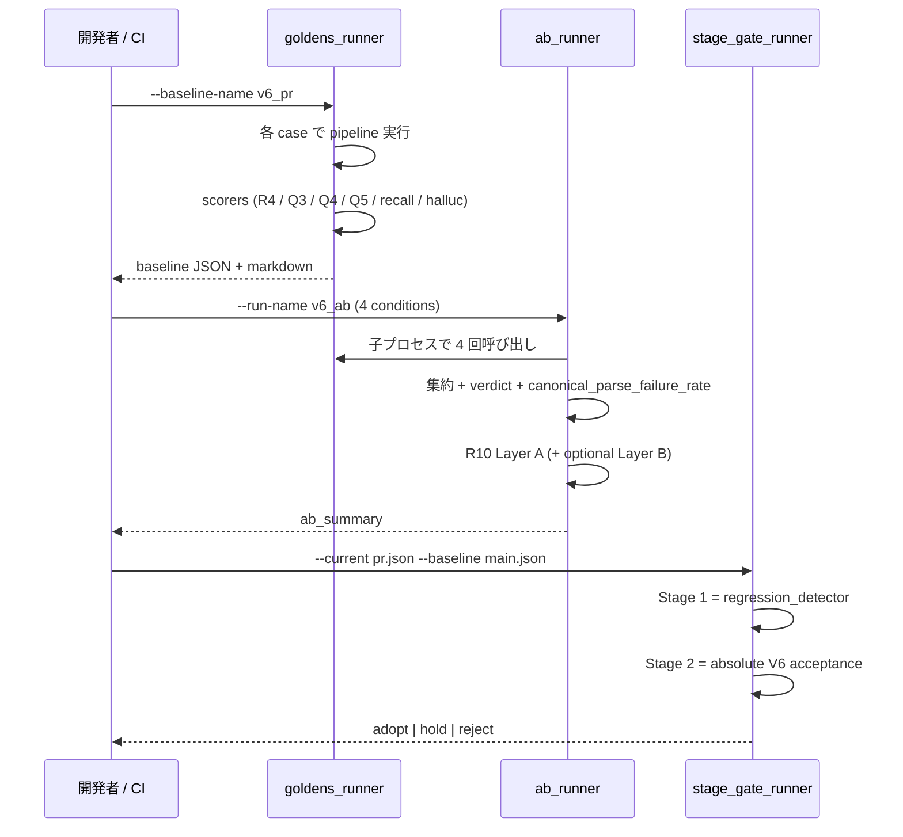

# V6 仕様 (品質基盤リファクタ)

`docs/README.md` の版履歴を単一ソースとして参照し、本書では V6 (v6.0 +
v6.1) の仕様だけを記述する。実装は `refactor/v6-quality` ブランチ。

## 0. 一行要約

V6 は **「LLM レポート品質を測定 → 検知 → ゲート」できる基盤を整備
した品質リファクタ**。コア機能は次の 6 件:

1. canonical Report JSON schema (v6.0)
2. 8 V6 feature flags (default off で v5.19 同等、`V6_COMPACT_TOP_ALERTS` は v6.6.0 で追加)
3. Q3 evidence grounding scorer (5 シグナル + 重み付け composite)
4. Q4 actionability scorer (7 dim + lenient/strict citation)
5. Q5 failure taxonomy (5 category)
6. R9 regression detector + R5 2-stage acceptance gate

V6.1 で MERGE/CREATE VIEW/INSERT skeleton 構造抽出 + Layer B LLM judge
+ LLM acceptance runbook を追加。

## 1. 全体アーキテクチャ図

## 2. 主要モジュール

| 配置 | ファイル | 役割 |
|------|---------|------|
| `dabs/app/core/` | `feature_flags.py` | 8 V6 flags の resolver (env > runtime-config > default off) |
| | `v6_schema/issue_registry.py` | issue_id 30 件単一レジストリ |
| | `v6_schema/normalizer.py` | ActionCard / Alert → canonical Report adapter |
| | `sql_skeleton.py` | SQL → 構造化 skeleton (8 method) |
| `dabs/app/core/llm_prompts/` | `parsing.py::extract_v6_canonical_block` | LLM 出力から canonical JSON 抽出 |
| | `prompts.py::_v6_canonical_output_directive` | LLM に canonical JSON emit を要求 |
| | `prompts.py::_no_force_fill_block` | "根拠不足は省略" directive |
| | `knowledge.py::get_always_include_section_ids` | ALWAYS_INCLUDE 縮小 |
| `schemas/` | `report_v6.schema.json` | canonical Report JSON Schema v6.0 |
| `eval/scorers/` | `r4_schema.py` | canonical schema validation |
| | `evidence_grounding.py` | Q3 (5 シグナル) |
| | `actionability.py` | Q4 (7 dim, lenient/strict 二系統) |
| | `failure_taxonomy.py` | Q5 (5 category) |
| | `recall.py` | Critical recall lenient + strict |
| | `hallucination.py` | Hallucination clean score |
| | `r10_quality.py` | R10 Layer A (deterministic) |
| | `r10_quality_judge.py` | R10 Layer B (LLM judge wrapper) |
| `eval/` | `goldens_runner.py` | 単条件 baseline runner |
| | `ab_runner.py` | 4 conditions A/B + R10 統合 |
| | `regression_detector.py` | 3-tier regression detection |
| | `stage_gate.py` + `stage_gate_runner.py` | R5 2-stage acceptance gate |

詳細索引: [`docs/v6/README.md`](v6/README.md)

## 3. canonical Report 構造 (v6.0)

詳細: [`docs/v6/output_contract.md`](v6/output_contract.md)

## 4. 品質指標 (5 指標)

| 指標 | scorer | 目標 (V6 acceptance) |
|------|--------|---------------------|
| **L1-L4 総合** | `eval/scorers/l1_syntax.py` + `l3l4_judge.py` | 4 段階で平均 3.3 以上 |
| **Hallucination 率** | `hallucination.py::score_canonical_report_hallucination` | < 5% (clean ≥ 0.85) |
| **Action 具体性** | `actionability.py::score_canonical_action` | ≥ 80% (6/7 dim) |
| **Critical issue recall** | `recall.py::score_canonical_recall` | ≥ 50% (strict) |
| **Regression 率** | `regression_detector.py` | < 10% case |

加えて V6 では:

| 拡張指標 | 由来 | 目標 |
|---------|------|------|
| **Q3 evidence grounding (composite)** | W3 + W3.5 加重 | ≥ 80% |
| **R4 schema pass rate** | W2.5 | = 100% |
| **Q5 failure taxonomy** | W5 | ≥ 70% |
| **R10 layer_a_score** | W4 + V6.1 | ≥ 0.80 |

正本: [`docs/eval/report_quality_rubric.md`](eval/report_quality_rubric.md)
+ [`docs/eval/v6_acceptance_policy.md`](eval/v6_acceptance_policy.md)

## 5. 8 V6 Feature Flags

| Flag | default | 機能 |
|------|---------|------|
| `V6_CANONICAL_SCHEMA` | off | LLM が canonical JSON block を直接 emit |
| `V6_REVIEW_NO_KNOWLEDGE` | off | Stage 2 review に knowledge を入れない |
| `V6_REFINE_MICRO_KNOWLEDGE` | off | Stage 3 refine knowledge を 4 KB cap |
| `V6_ALWAYS_INCLUDE_MINIMUM` | off | ALWAYS_INCLUDE を `bottleneck_summary` のみに |
| `V6_SKIP_CONDENSED_KNOWLEDGE` | off | 二次要約呼び出しを skip |
| `V6_RECOMMENDATION_NO_FORCE_FILL` | off | "根拠不足は省略" directive を prompt 末尾に追加 |
| `V6_SQL_SKELETON_EXTENDED` | off | MERGE/VIEW/INSERT を構造抽出 (V6.1) |
| `V6_COMPACT_TOP_ALERTS` | off | `## 2. Top Alerts` 廃止、Section 1 末尾 `### Key Alerts` 統合 + issue-tag 参照 (v6.6.0) |

priority: env var > runtime-config.json > default

すべて off で v5.19 同等動作 (regression なし)。詳細:
[`docs/knowledge/v6_knowledge_policy.md`](knowledge/v6_knowledge_policy.md)

## 6. 評価フロー

詳細: [`docs/eval/ab_runner_design.md`](eval/ab_runner_design.md) +
[`docs/eval/regression_detector_design.md`](eval/regression_detector_design.md)

## 7. 適用条件

| 利用シーン | コマンド | 期待 verdict |
|-----------|---------|-------------|
| 開発者 PR | `python -m eval.ab_runner --gate-w4-infra` | infra pass |
| Nightly main | `... --with-llm-judge --gate-llm-quality` | adopt 推奨 |
| Release tag | `... --gate-r10-verdict pass` | adopt 必須 |

LLM 込み完全 acceptance run: [`docs/eval/llm_acceptance_runbook.md`](eval/llm_acceptance_runbook.md)

## 8. Codex レビュー履歴

| 日付 | 対象 | 結果 |
|------|------|------|
| 2026-04-25 | V6 W1+W2 | 10 ギャップ指摘 → W2.5 で全件解消 |
| 2026-04-25 | V6 W3 | 5 ギャップ指摘 → W3.5 で全件解消 |
| 2026-04-25 | V6 W4 | gate 名前混在を指摘 → W4 Day 7 で infra/llm-quality 分割 |
| 2026-04-25 | V6 W5 | 6 指摘 → W5 Day 7 + W6 で対応 |
| 2026-04-25 | V6 W6 | 3 持ち越し → V6.1 で対応 |
| 2026-04-25 | V6.1 | merge-ready 判定、Layer B canonical persist が V6.2 tier 1 |

V6 終了状態は **merge-ready candidate (品質基盤完成、production-ready
は LLM 込み実走後)**。

## 9. v6.x 運用反映 (v6.0 後)

W1-W6 + V6.1 の基盤構築後、以下のとおり運用フィードバックで進化:

| 版 | 主追加 |
|---|---------|
| v6.1.0 | rule-based `decimal_heavy_aggregate` ActionCard + Q23 退行修正 |
| v6.2.0 | **5 layer feedback model 導入** — L1 (`rule_echo_in_llm`) + L2 (profile-signature invariants) + L5 feedback box |
| v6.3.0 | per-action 改善要望 UI |
| v6.4.0 | L5 Phase 1 (per-analysis ZIP export + signed token + redaction) |
| v6.5.0 | L5 Phase 1.5 (bulk ZIP + admin gate + orphan_reason) |
| v6.5.x | i18n 整理 (67 JA-msgid → EN msgid + ja.po 訳) |
| v6.6.0 | Top Alerts compact (Section 1 統合 + issue-tag 参照、新 flag `V6_COMPACT_TOP_ALERTS`) |

詳細: [`docs/v6/README.md`](v6/README.md) §8、[`docs/v6/five-layer-feedback.md`](v6/five-layer-feedback.md)

## 10. backlog

| 項目 | 由来 | 参照 |
|------|------|------|
| L5 Phase 2: 中央 ingest pipeline (vendor_account_id + landing/staged/promoted 昇格) | Codex 2026-04-26 | TODO.md `## L5 Phase 2` |
| strict mode redaction (table/column 名も hash) | Codex Phase 2 推奨 | TODO.md |
| canonical Report Delta persist (Layer B 完全化) | V6.2 (Tier 1) | TODO.md |
| UPDATE / DELETE SQL skeleton | V6.2 (Tier 2) | TODO.md |
| PR comment 自動化 / Slack notification | V6.2 (Tier 2) | TODO.md |

## 11. ファイル参照

本書からの個別仕様への入口:

- **開発者 onboarding**: [`docs/v6/getting-started.md`](v6/getting-started.md)
- **5 層品質モデル**: [`docs/v6/five-layer-feedback.md`](v6/five-layer-feedback.md)
- 概要: [`docs/v6/README.md`](v6/README.md)
- 評価設計: [`docs/eval/`](eval/)
  - rubric: [`report_quality_rubric.md`](eval/report_quality_rubric.md)
  - acceptance: [`v6_acceptance_policy.md`](eval/v6_acceptance_policy.md)
  - LLM runbook: [`llm_acceptance_runbook.md`](eval/llm_acceptance_runbook.md)
- canonical / schema: [`docs/v6/output_contract.md`](v6/output_contract.md)
- knowledge policy: [`docs/knowledge/v6_knowledge_policy.md`](knowledge/v6_knowledge_policy.md)
- SQL skeleton: [`docs/v6/sql_skeleton_design.md`](v6/sql_skeleton_design.md)
- V6.1 計画: [`docs/v6/v61_plan.md`](v6/v61_plan.md)
- API endpoint カタログ: [`docs/v6/api-endpoints.md`](v6/api-endpoints.md)
- 評価運用シナリオ: [`docs/v6/operations.md`](v6/operations.md)

## 12. 対象バージョン

本 docs セットは **v6.6.0** を対象とする。版履歴の単一ソースは
`docs/README.md` のままで、V6 関連の追記は本書経由で参照する。

## 13. 貢献

V6 仕様変更は、コードと同 PR で本書 (および `docs/v6/`) を更新する。
規模が大きい変更 (例: V6.2 のスコープ追加) は `TODO.md` の V6 セクション
に短い announcement を入れてから PR を出すことを推奨。
